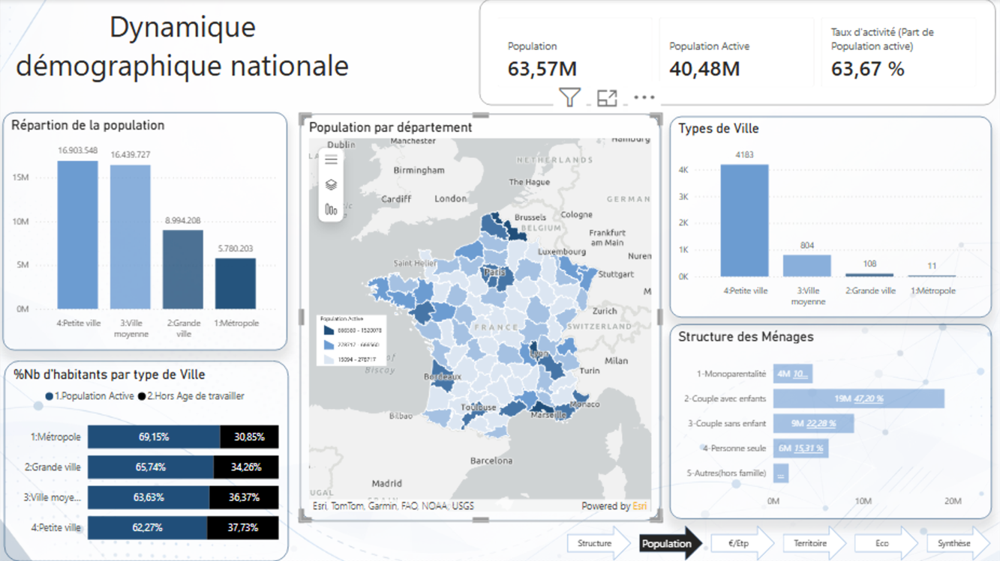
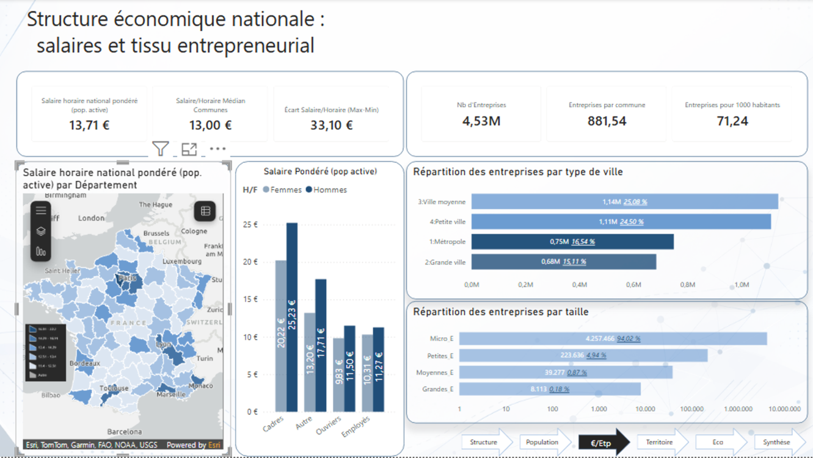
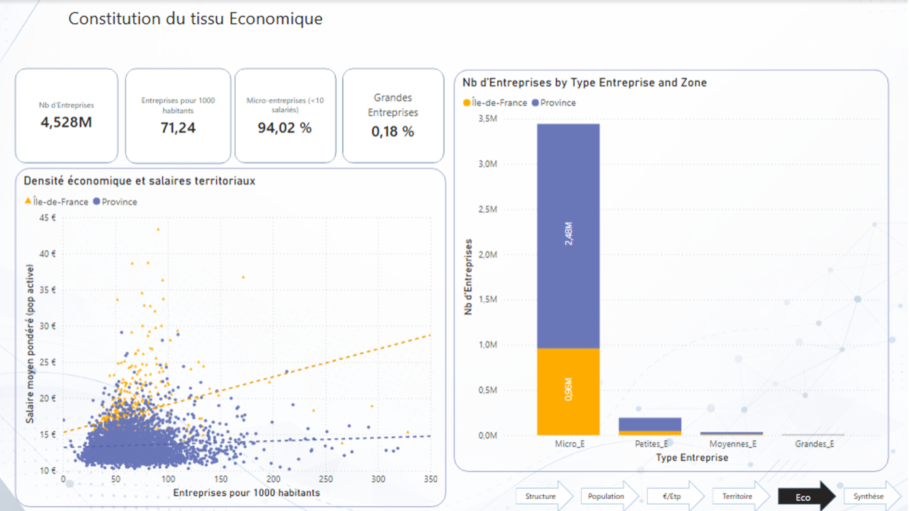
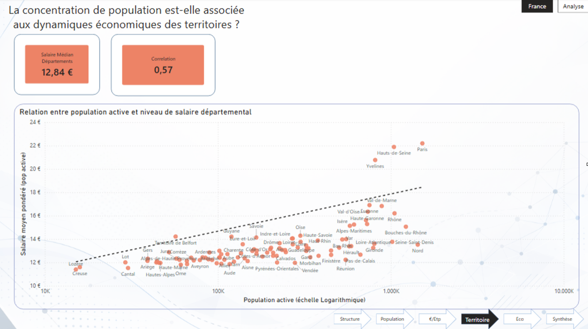

# French-Industry-Analysis
Data analysis project on French territorial disparities (population, wages, business density) — (Python, pandas, Power BI)

# 🇫🇷 French Industry Analysis — Population, Business Density & Wage Disparities

A data analysis project investigating how demographics and economic structure shape wage disparities across French territories, using public INSEE datasets, Python, and an interactive Power BI dashboard.

* Team project — completed as part of a Data Analyst certification *

## 💡 Skills Demonstrated

- Data cleaning and validation across multiple large, heterogeneous datasets (Python/pandas)
- Consistency checks between related variables (verifying wages by category and sex don't contradict each other)
- Recoding categorical columns, aggregating granular columns into readable categories
- Dashboard design with a clear analytical narrative (context → structure → relationship → synthesis)
- DAX measures and correlation analysis in Power BI
- Communicating statistical findings (correlation coefficients, distributions) to a non-technical audience

## 📋 Context & Objective

In France, income disparities aren't only explained by individual factors like occupation or qualification level — territory plays a major role too, shaping economic dynamics, access to employment, and wage levels.

**Research question:** What economic and territorial factors influence the distribution of population across France?

To answer this, the project combined:
1. **Python** for data preparation, cleaning, and exploratory analysis across 4 public datasets
2. **Power BI** for building an interactive dashboard to explore the relationships between population, business density, and wages

## 📊 Data

Four datasets from INSEE (France's national statistics institute), joined on the `CODGEO` commune-level identifier:

| Dataset | Rows | Description |
|---|---|---|
| `net_salary_per_town_categories.csv` | 5,136 | Average net salary per commune, broken down by socio-professional category, sex, and age group |
| `base_etablissement_par_tranche_effectif.csv` | 36,681 | Number of businesses per commune, broken down by workforce size |
| `name_geographic_information.csv` | 36,840 | Administrative and geographic reference data (region, department, coordinates) |
| `population.csv` | 8.5M+ | Population counts per commune, by age group, sex, and household type |

## 🛠️ Stack

- **Python** (pandas) — data cleaning, exploration, consistency checks
- **Power BI** (DAX) — interactive dashboard, correlation analysis, geographic visualization

## 🔍 Methodology

1. **Data cleaning (Python)** — audited each dataset for missing values, duplicates, and type consistency; standardized INSEE codes (5-digit formatting); aggregated granular workforce-size columns into readable business-size categories (Micro/Small/Medium/Large).
2. **Exploratory visualizations** — checked distributions and missing-value patterns before building the dashboard.
3. **Dashboard design** — built as a progressive narrative across 5 pages: demographic context → economic structure → territorial relationships → synthesis.

## 📈 Key Findings

### 1. Demographic Context

Population is heavily concentrated in small and medium-sized towns, but this doesn't translate into proportionally higher economic activity. Metropolises show a notably higher working-age population share (69.15%) than small towns (62.27%), pointing to a higher productive potential in large urban centers.

### 2. Economic Structure & Wage Disparities

- National weighted average wage: **€13.71/hour**, with a **€33.10** spread between the highest and lowest earners — a clear sign of significant wage dispersion across France.
- Wage gaps by socio-professional category are substantial: executives ("cadres") earn roughly double the hourly wage of employees or workers.
- A persistent gender pay gap appears across all categories, most pronounced among executives (€25.23 for men vs. €20.22 for women).

### 3. Business Fabric

- France's economic fabric is overwhelmingly composed of micro-businesses (**94.02%** of all businesses have fewer than 10 employees), while large companies (200+ employees) represent only **0.18%**.
- This matters for wages: large companies are typically associated with higher-skilled jobs and better compensation, so a region's business-size mix can partly explain local wage levels.

### 4. Population Density vs. Wage Levels

- A clear positive relationship exists between active population size and average wage at the departmental level.
- This relationship is **notably stronger in Île-de-France** (correlation r = 0.56) than in the rest of France / "Province" (r = 0.39) — suggesting Île-de-France converts population concentration into economic value more efficiently than other regions.
- Business density (number of businesses per 1,000 inhabitants) shows the same pattern: a steeper wage increase with density in Île-de-France than in Province.

## 🎯 Conclusion

The distribution of population across France results from the interaction of several demographic and economic factors, rather than any single driver. Territories combining high active-population concentration with dense economic activity tend to show higher wages, reinforcing their attractiveness — while less economically dynamic territories show both lower wages and different demographic structures.

The Île-de-France vs. Province comparison illustrates this particularly well: the same increase in active population or business density translates into a much steeper wage increase in Île-de-France, suggesting the region's economic fabric converts population concentration into economic value more efficiently than the rest of the country.

These results should be read as **correlational, not causal** — the data shows a strong association between these variables, not a proven causal chain.

## ⚠️ Limitations

- The salary dataset covers only 5,136 of France's ~35,000 communes — likely reflecting communes with a minimum level of economic activity and reliable reporting, not a data-processing loss.
- Some communes share the same INSEE code across multiple rows (due to multiple administrative attachments, e.g. different electoral districts) — the commune itself was kept as the unit of analysis.
- An outlier was observed in one salary variable (max age 18–25 salary = 61€ vs. a mean of 10€) but was not treated at this stage, as it plausibly reflects local specificities (small workforce, high concentration of executives) rather than a data error.
- Correlation coefficients (r = 0.56 / 0.39) measure the strength of a relationship, not causation — other unmeasured factors (industry sector mix, socio-professional structure) likely also play a role, as noted in the original report's "next steps" section.

